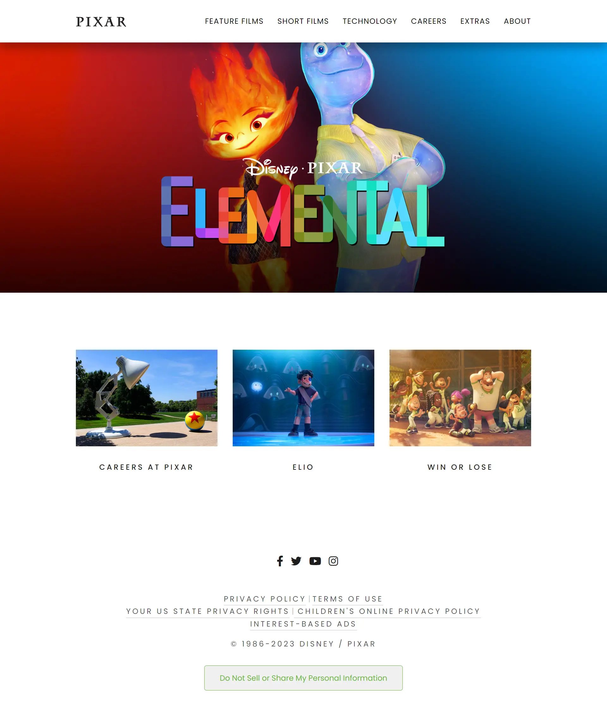

# Pixar Website Remake

 

## 📃 About the website

The Pixar Website Remake is recreation of the iconic Pixar website, aiming to capture the essence of the original while offering an interactive experience that showcases the magic of Pixar's world-renowned animation.

## 🧰 Technologies Used

The Pixar website remake is built using the following technologies:

- React Js
- TypeScript
- Sass/SCSS

## 📸 Screenshot

## 💻 Features

The Furniq website offers the following features:

- **Movie Showcase**: Explore a virtual gallery highlighting Pixar's iconic films
- **Seamless Navigation**: Navigate effortlessly through various sections of the website using an intuitive menu design.
- **Responsive Design**: Enjoy a seamless experience on different devices.

**Disclaimer:** The Pixar Website Remake is an educational project and is not affiliated with or endorsed by Pixar Animation Studios.
